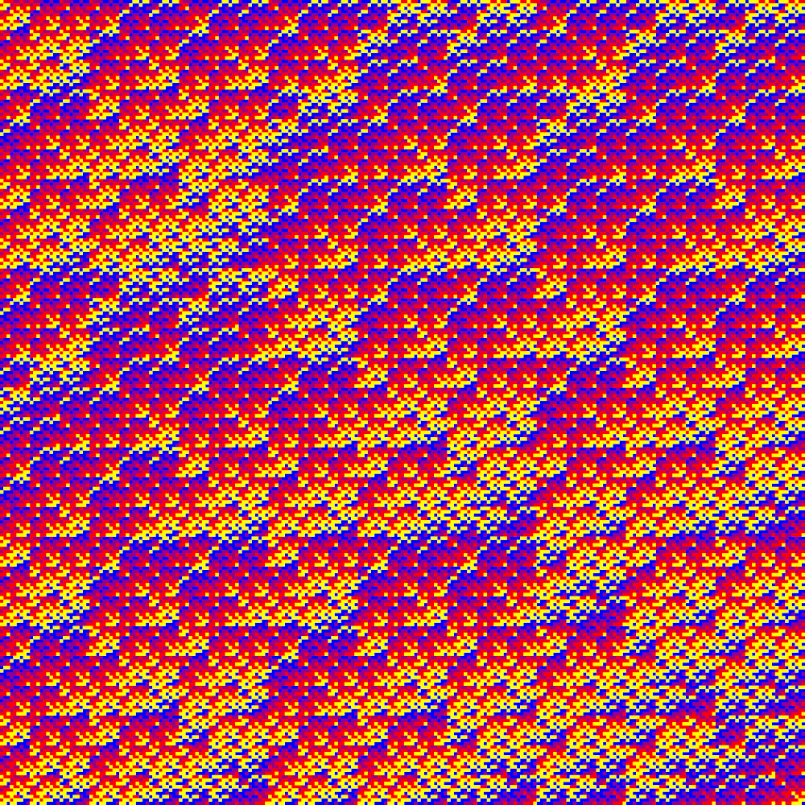

# Recursive Tilings
Creating (hopefully) nice images with recursive algorithms.

## Examples
<!--- [Example 1](img/outsum_F112_mod4_it9_rgb.png)
[Example 3](img/tiles_A1234_mod4_it5_rgb.png) -->

## Description:
The images are visualisations of matrices that are algorithmically created from a set of base matrices.
The basic ideas are presented here, see `tiling.pdf` for more detailed description of the algorithms.

### Recursive Tiling:
- The base matrices all have to have the same dimensions and integer values from `{1,...,n}` where `k` is also the number of base matrices.
- In each step, the next matrix `A(i+1)` is constructed from the current matrix `A(i)` by replacing each matrix element with the corresponding base matrix.

### Outer sum:
- This algorithm applies a variant of the [Kroenecker Product](https://en.wikipedia.org/wiki/Kronecker_product) in each step, but instead of multiplying, it adds modulo a maximum number.

## Requirements:
Code is written in Python 3, using the following packages:
- numpy
- math
- random
- queue
- os
- matplotlib

## Running:
Run `basic_examples.py` to see all possible combinations of settings.

